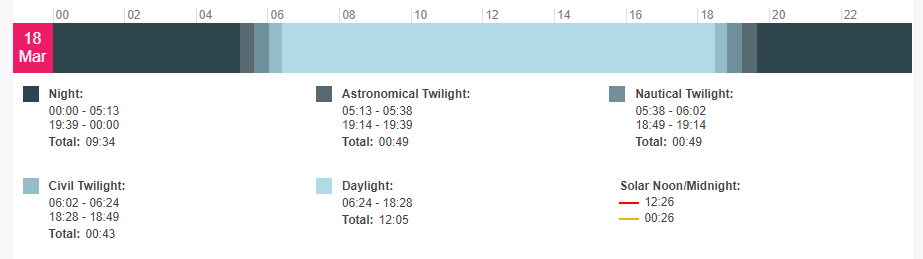
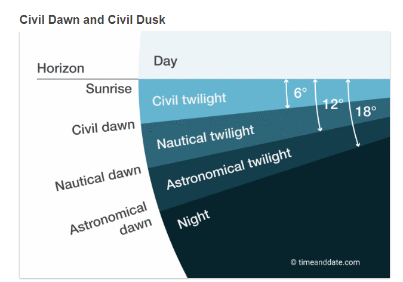

# TridentTD_SunriseSunset

ไลบรารี่ สำหรับเพลทฟอร์ม Arduino IDE  
สำหรับคำนวณเวลาพระอาทิตย์ขึ้นและตก  
รวมทั้ง เวลา เริ่มแสงฟ้าสาง / แสงเงินแสงทอง (Twilight)  
ณ ตำแหน่ง latitude / longitude และ timezone ที่กำหนด  
  
ตัวอย่าง ดูใน ไลบรารี่  
  

  

  
  

  

  

TridentTD  
18/03/2019  
